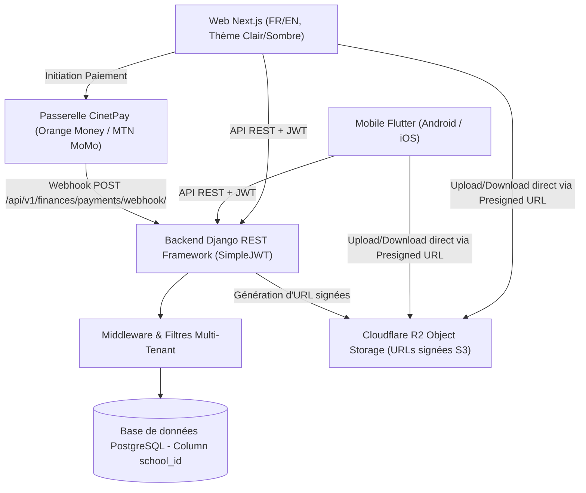

# 🏫 Scolyva — Plateforme SaaS Multi-Tenant de Gestion Scolaire

[](https://nextjs.org/)
[](https://www.django-rest-framework.org/)
[](https://flutter.dev/)
[](https://www.postgresql.org/)
[](https://cinetpay.com/)
[](https://www.cloudflare.com/products/r2/)

> **URLs de Production Officielles** :
> - 🌐 **Application Web (Vercel)** : [https://scolyva.vercel.app](https://scolyva.vercel.app)
> - ⚙️ **Backend API REST (Render)** : [https://scolyva.onrender.com](https://scolyva.onrender.com)
> - 🔒 **Interface Administration Django** : [https://scolyva.onrender.com/admin/](https://scolyva.onrender.com/admin/)

> **Positionnement Produit** : *« L'école sait toujours qui doit quoi. Le parent sait toujours ce qu'il doit payer. »*

**Scolyva** est une plateforme SaaS multi-tenant complète et moderne de gestion scolaire, spécialement conçue pour les établissements scolaires du Cameroun et d'Afrique francophone/anglophone. Elle orchestre la gestion des élèves, la scolarité, les notes, le calcul automatique des moyennes de séquence, les bulletins, la présence et le recouvrement des frais par Mobile Money (Orange Money, MTN MoMo).

---

## 🌟 Points Forts & Architecture

- 🔒 **Isolation Multi-Tenant Serveur Strict** : Base de données PostgreSQL partagée avec colonne `school_id`. Filtrage automatique au niveau Django via `TenantModel`, `TenantManager` et `TenantMiddleware` sans fuite de données entre établissements.
- ⏱️ **Période d'Essai 14 Jours & Mode Lecture Seule** : À l'inscription autonome d'un établissement, 14 jours d'essai gratuit sont activés. Si aucun abonnement n'est réglé à l'échéance, l'accès bascule automatiquement en **Lecture Seule** (les modifications sont bloquées avec une bannière d'alerte, mais les données restent consultables sans aucune perte).
- 📚 **Double Système Éducatif (Bilingue)** :
  - **Francophone** : 6ème à Terminale (séries A, C, D, etc.), évaluations séquentielles, notes sur 20, moyennes générales pondérées par coefficients.
  - **Anglophone** : Form 1 à Form 5, Lower & Upper Sixth (Science / Arts), évaluation par termes/séquences.
- 💳 **Recouvrement & Paiement Mobile Money (CinetPay)** : Suivi individuel du solde élève (`StudentBalance`), paiement autonome des parents par Orange Money et MTN MoMo via CinetPay, validation par Webhook sécurisé et génération de reçus officiels.
- ☁️ **Stockage Fichiers Cloudflare R2 (URLs Signées)** : Aucun fichier binaire ne transite par les serveurs Django. Upload/Download direct entre le client (Next.js/Flutter) et R2 grâce aux presigned URLs S3 (`boto3`).
- 🌐 **Expérience Utilisateur Premium (Web + Mobile)** : Interface Next.js et Flutter bilingue (Français / Anglais) avec bascule instantanée clair/sombre et mémorisation du thème.

---

## 🏗️ Architecture Technique



---

## 🛠️ Stack Technologique

| Couche | Technologie | Description |
|---|---|---|
| **Backend API** | Django 4.2 + Django REST Framework | Logique métier, calculs, permissions, webhooks |
| **Authentification** | SimpleJWT (`djangorestframework-simplejwt`) | Access & Refresh Tokens partagés Web/Mobile |
| **Frontend Web** | React / Next.js 14 (App Router) | Portals Super Admin, School Admin, Comptable, Enseignant, Parent, Élève |
| **Frontend Mobile** | Flutter (Android & iOS) | Application native responsive cross-platform |
| **Base de données** | PostgreSQL / SQLite (Dev) | Isolation multi-tenant par `school_id` |
| **Stockage** | Cloudflare R2 (compatible S3) | Presigned URLs via `boto3` |
| **Paiements** | CinetPay | Orange Money, MTN MoMo, Cartes bancaires |
| **Design** | Tailwind CSS + Google Outfit Font | Thèmes clair/sombre, glassmorphism, animations |

---

## 🚀 Guide d'Installation et Lancement

### Préréquis
- Python 3.11+
- Node.js v20+ / npm v10+
- Flutter SDK 3.x+ (pour le mobile)

---

### 1. Démarrer le Backend Django

```powershell
cd backend

# Activation de l'environnement virtuel
.\venv\Scripts\activate

# Installation des dépendances
python -m pip install -r requirements.txt

# Migrations et initialisation des données de démo
python manage.py makemigrations tenants users academics finances attendance notifications storage
python manage.py migrate
python manage.py seed_scolyva

# Démarrage du serveur backend
python manage.py runserver 0.0.0.0:8000
```
Le backend sera disponible sur **`http://localhost:8000`**.

---

### 2. Démarrer le Frontend Web Next.js

```powershell
cd frontend

# Installation des dépendances Node
npm install

# Démarrage du serveur de développement Next.js
npm run dev
```
L'application Web sera accessible sur **`http://localhost:3000`**.

---

### 3. Démarrer l'Application Mobile Flutter

```powershell
cd mobile

# Récupération des dépendances Flutter
flutter pub get

# Lancement sur émulateur ou appareil connecté
flutter run
```

---

## 📑 Référence des Endpoints API Principaux

| Méthode | Endpoint | Description | Permission |
|---|---|---|---|
| `POST` | `/api/v1/auth/register-school/` | Inscription autonome d'une école (Essai 14j) | Public |
| `POST` | `/api/v1/auth/login/` | Connexion JWT (retourne jetons + memberships) | Public |
| `GET` | `/api/v1/tenants/school/current/` | Informations de l'école courante | Authentifié |
| `POST` | `/api/v1/tenants/school/subscribe/` | Souscription à un plan via CinetPay | Admin École |
| `GET` | `/api/v1/academics/students/` | Liste filtrée des élèves de l'établissement | Authentifié |
| `POST` | `/api/v1/academics/grades/bulk-entry/` | Saisie groupée des notes par séquence | Enseignant |
| `POST` | `/api/v1/academics/report-cards/generate/` | Calcul des moyennes et génération des bulletins | Admin École |
| `GET` | `/api/v1/finances/overview/` | Tableau de bord de recouvrement & impayés | Comptable |
| `POST` | `/api/v1/finances/payments/initiate/` | Initialisation d'un paiement CinetPay | Parent / Comptable |
| `POST` | `/api/v1/finances/payments/webhook/` | Callback de validation serveur-à-serveur CinetPay | Public |
| `POST` | `/api/v1/storage/presign-upload/` | Obtenir une URL signée R2 pour upload direct | Authentifié |

---

## 🧪 Tests Automatisés

Pour exécuter la suite de tests automatisés (isolation multi-tenant, permissions d'essai, moteur de calcul des notes) :

```powershell
cd backend
python manage.py test apps.tenants.tests apps.academics.tests
```

---

## 📜 Licence

Projet sous licence propriétaire **Scolyva SAS** — Tous droits réservés.
